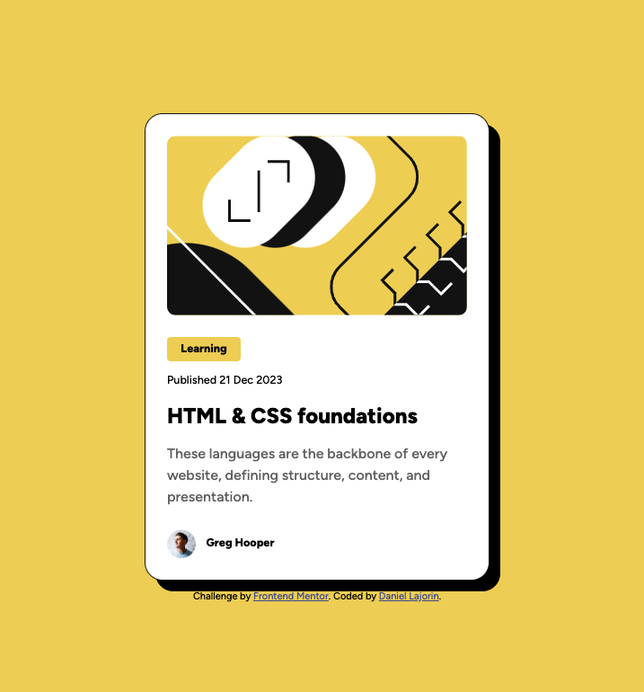

# Frontend Mentor - Blog preview card solution

This is a solution to the [Blog preview card challenge on Frontend Mentor](https://www.frontendmentor.io/challenges/blog-preview-card-ckPaj01IcS). Frontend Mentor challenges help you improve your coding skills by building realistic projects. 

## Table of contents
  - [The challenge](#the-challenge)
  - [Screenshot](#screenshot)
  - [Links](#links)
- [My process](#my-process)
  - [Built with](#built-with)
  - [What I learned](#what-i-learned)
  - [Continued development](#continued-development)
  - [Useful resources](#useful-resources)
- [Author](#author)
- [Acknowledgments](#acknowledgments)

**Note: Delete this note and update the table of contents based on what sections you keep.**

### The challenge

Users should be able to:

- See hover and focus states for all interactive elements on the page

### Screenshot

### Links

- Solution URL: [Solution URL](https://github.com/DAJ350/blog-preview-card-main)
- Live Site URL: [Live Site URL](https://daj350.github.io/blog-preview-card-main/)

## My process

### Built with

- Semantic HTML5 markup
- Flexbox
- Figma 

### What I learned

I started this project thinking it would be a walk in the park. BOY was I wrong. I got a brutal reminder that I am still at the start of my learning 😅.

My main struggle was figuring out how to closely match the sizing of the elements to the dimensions provided in the design files without relying fixed measurements and media queries. 

For a while I thought the issue was sporuting from the size I set the entire card to but in the end I realised that it was a font-sizing problem. Once I realised this, I began looking in the direction of fluid typography and stumbled across the clamp() function.

### Continued development

Moving forward, I need more practice with fluid typography and creating responsive designs over all. I look forward to practicing this with more Frontend Mentor projects. 

### Useful resources

- [Clamp() MDN Documentation](https://developer.mozilla.org/en-US/docs/Web/CSS/clamp) - This helped me learn the basics of using the clamp() function. 

## Author

- GitHub - [DAJ350](https://github.com/DAJ350)
- Frontend Mentor - [@DAJ350](https://www.frontendmentor.io/profile/DAJ350)
